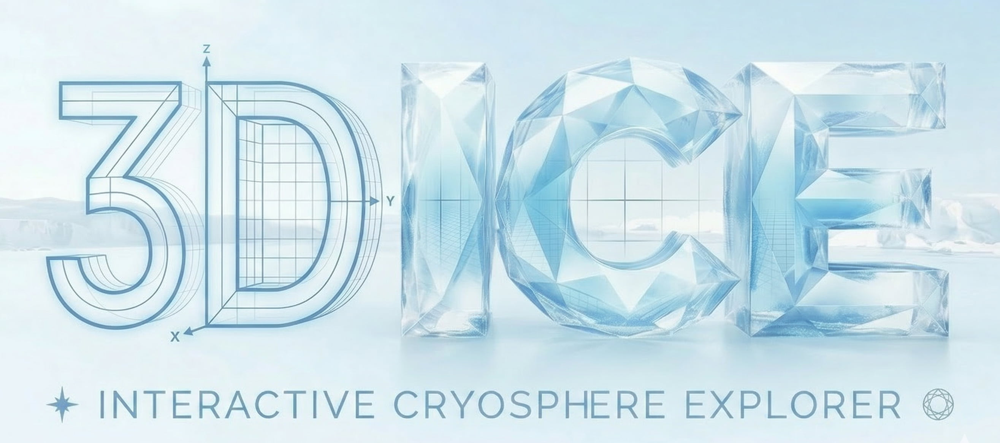
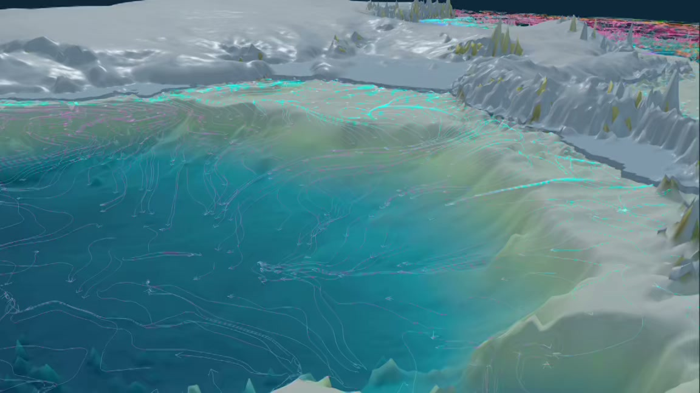
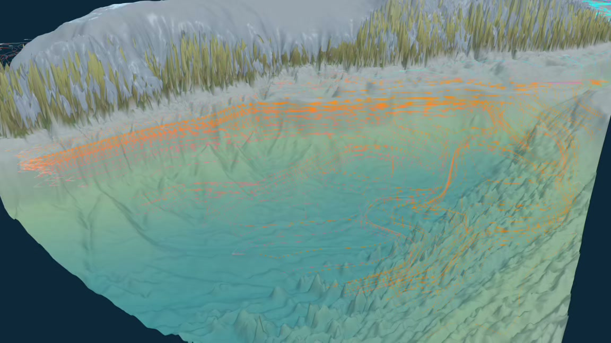

<p align="center">
  <picture>
    <source media="(prefers-color-scheme: dark)" srcset="static/tools/3d-ice-logo.jpg">
    <source media="(prefers-color-scheme: light)" srcset="static/tools/3d-ice-logo-light.jpg">
    
  </picture>
</p>

<h1 align="center">3D ICE</h1>

<p align="center">
  <strong>Interactive 3D Cryosphere Explorer for Antarctica and Greenland</strong>
</p>

<p align="center">
  3D ICE turns state-of-the-art cryosphere datasets into an explorable browser experience for
  research communication, teaching, and public engagement.
</p>

<p align="center">
  <a href="https://3d-ice.com/">Website</a>
  ·
  <a href="https://3d-ice.com/tools/3D-interactive-cryosphere-explorer.html">Launch Explorer</a>
  ·
  <a href="https://github.com/yuwang115/3d-ice/releases">Releases</a>
</p>

<p align="center">
  <a href="https://github.com/yuwang115/3d-ice/actions/workflows/deploy-pages.yml">
    
  </a>
  <a href="https://github.com/yuwang115/3d-ice/actions/workflows/release-compat-bundle.yml">
    
  </a>
  
  
  
</p>

## Overview

3D ICE is a standalone source repository for the full 3D ICE experience: the GitHub Pages site,
the interactive browser runtime, bundled cryosphere datasets, preview media, and the preparation
scripts used to turn scientific source data into web-ready assets.

The project is designed to bridge rigorous glaciological research and public curiosity. It lets
people rotate, zoom, and layer Antarctica and Greenland datasets directly in the browser, then jump
from the visualization to the underlying source products.

<table>
  <tr>
    <td width="50%" valign="top">
      
      <br>
      <sub><strong>Antarctica</strong>: velocity, basin boundaries, subglacial hydrology, ocean circulation, basal friction, and RISE ice-shelf context.</sub>
    </td>
    <td width="50%" valign="top">
      
      <br>
      <sub><strong>Greenland</strong>: bed topography, outlet-glacier velocity, basin structure, basal friction, and fjord-connected ocean circulation.</sub>
    </td>
  </tr>
</table>

## Why This Repo Exists

- Publish `static/` directly to GitHub Pages as a standalone site.
- Preserve the legacy `/tools/...` public paths used by the main personal site.
- Ship a compatibility bundle for downstream deployment into another repo.
- Keep runtime assets, prepared data products, and data-preparation tooling together.

## Experience Highlights

| Capability | What 3D ICE provides |
| --- | --- |
| Fully interactive 3D viewing | Rotate, zoom, and inspect Antarctica and Greenland as if handling a physical model. |
| Layered cryosphere exploration | Combine bed topography, surface velocity, basin boundaries, basal friction, subglacial hydrology, and ocean streamlines in one scene. |
| Antarctica-specific overlays | Explore WAOM2 ocean circulation, IMBIE-refined basins, subglacial channels, and RISE basal melt plus thermal-driving fields. |
| Greenland-specific overlays | Explore ITS_LIVE velocity mosaics, Greenland basin boundaries, basal friction fields, and clipped Arctic ocean circulation around Greenland. |
| Research-friendly workflow | The runtime exposes direct links back to the source datasets, so the visual layer stays connected to the original scientific products. |
| Cross-platform delivery | Balanced presets support mobile touchscreens, while HD options target larger desktop displays. |
| Flexible deployment | The runtime auto-detects project-path prefixes, so it works both at a site root and under GitHub Pages project paths such as `/3d-ice/tools/...`. |

## Quick Start

### Preview the site locally

The site itself is static. A simple local file server is enough:

```bash
cd static
python3 -m http.server 4173
```

Then open:

- `http://127.0.0.1:4173/`
- `http://127.0.0.1:4173/tools/3D-interactive-cryosphere-explorer.html`

### Build the compatibility bundle

The bundling utilities use only built-in Node APIs. Node 20+ is the expected environment because
that is what the release workflow uses.

```bash
npm run bundle:compat
npm run smoke:compat
```

This produces:

- `dist/3d-ice-compat.tar.gz`
- `dist/3d-ice-compat.tar.gz.sha256`
- `dist/3d-ice-compat-manifest.json`

The tarball always expands to a top-level `tools/` directory so the main site can continue serving
legacy `/tools/...` URLs unchanged.

## Repository Layout

| Path | Purpose |
| --- | --- |
| `static/index.html` | Standalone landing page for the site root. |
| `static/css/3d-ice-home.css` | Vendored landing-page custom styles used by the site root. |
| `static/tools/3D-interactive-cryosphere-explorer.html` | Main interactive runtime. |
| `static/tools/data/` | Web-ready cryosphere datasets and metadata packages. |
| `static/tools/media/3d-ice/` | Preview stills and loop videos used across the experience. |
| `static/tools/vendor/three/` | Vendored Three.js runtime dependencies. |
| `scripts/` | Data preparation, visualization support, trailer capture, and release utilities. |
| `dist/` | Generated compatibility bundle artifacts. |
| `.github/workflows/` | GitHub Pages deployment and compatibility release automation. |

## Core Data Layers

| Region | Layers in the experience | Representative source products |
| --- | --- | --- |
| Antarctica | Bed topography, surface elevation, thickness, mask, refined basins, velocity, basal friction, subglacial hydrology, ocean streamlines, basal melt, thermal driving | [BedMachine Antarctica v4](https://nsidc.org/data/NSIDC-0756/versions/4), [MEaSUREs Antarctic Boundaries v2](https://nsidc.org/data/NSIDC-0709/versions/2), [MEaSUREs Phase-Based Antarctica Velocity v1](https://nsidc.org/data/NSIDC-0754/versions/1), [Antarctic basal friction inversions](https://essopenarchive.org/doi/full/10.22541/essoar.177099457.70593031), [GlaDS Antarctic subglacial hydrology](https://zenodo.org/records/12738170), [WAOM2](https://www.frontiersin.org/journals/marine-science/articles/10.3389/fmars.2023.1027704/full), [RISE](https://data.aad.gov.au/metadata/RISE) |
| Greenland | Bed topography, surface elevation, thickness, mask, basin boundaries, velocity, basal friction, ocean streamlines | [BedMachine Greenland v6](https://nsidc.org/data/idbmg4/versions/6), [MEaSUREs ITS_LIVE v2](https://nsidc.org/data/NSIDC-0776/versions/2), [Greenland basal friction ensemble inversion reference](https://essopenarchive.org/doi/full/10.22541/essoar.177099472.28419248), [Copernicus Marine Arctic Ocean Physics](https://data.marine.copernicus.eu/product/ARCTIC_ANALYSISFORECAST_PHY_002_001/description) |

## Standalone GitHub Pages Site

This repository publishes `static/` directly to GitHub Pages. That serves:

- `/` as the standalone landing page
- `/css/3d-ice-home.css` as the vendored landing-page stylesheet
- `/tools/3D-interactive-cryosphere-explorer.html` as the main runtime
- `/tools/data/*`, `/tools/media/3d-ice/*`, `/tools/vendor/*`, and `/tools/3d-antarctica/` as supporting assets

The Pages workflow writes `static/.nojekyll` before deployment so the project-path asset layout is
preserved exactly as shipped.

## Release Flow

1. Push to `main` to deploy `static/` to GitHub Pages.
2. Push a tag like `v0.1.0` to build and publish compatibility assets to a GitHub release.
3. Use `workflow_dispatch` when you want either workflow to run manually.

The release workflow uploads and optionally publishes:

- `dist/3d-ice-compat.tar.gz`
- `dist/3d-ice-compat.tar.gz.sha256`
- `dist/3d-ice-compat-manifest.json`

## Project Scope

This repo is intentionally focused on the standalone 3D ICE experience and related distribution
artifacts. It is the source of truth for:

- the browser runtime
- the standalone landing page
- prepared data bundles
- preview media
- compatibility packaging for downstream deployment

If you are looking for the broader personal site that consumes the compatibility bundle, this repo
is the upstream asset and runtime source rather than the final umbrella website.
