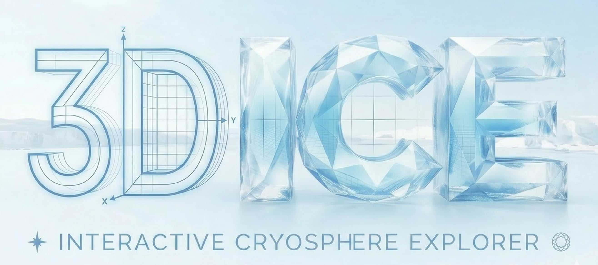
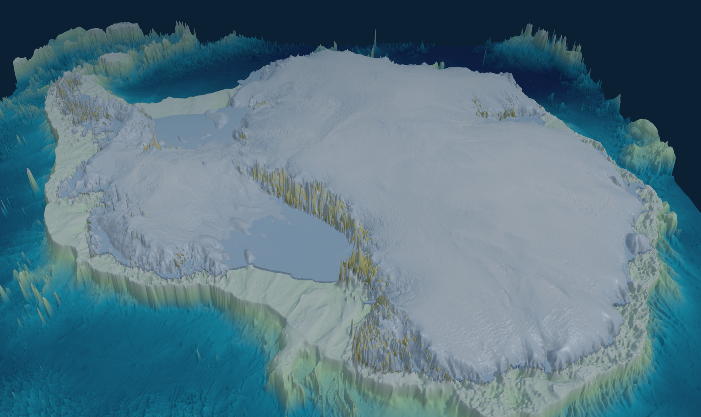

<p align="center">
  <picture>
    <source media="(prefers-color-scheme: dark)" srcset="static/tools/3d-ice-logo.jpg">
    <source media="(prefers-color-scheme: light)" srcset="static/tools/3d-ice-logo-light.jpg">
    
  </picture>
</p>

<h1 align="center">3D ICE</h1>

<p align="center">
  <a href="https://github.com/yuwang115/3d-ice/actions/workflows/ci.yml"></a>
  <a href="https://github.com/yuwang115/3d-ice/actions/workflows/draft-pdf.yml"></a>
  <a href="LICENSE"></a>
</p>

<p align="center">
  <strong>Interactive 3D Cryosphere Explorer for Antarctica and Greenland</strong>
</p>

<p align="center">
  3D ICE turns state-of-the-art cryosphere datasets into an explorable browser experience for
  research communication, teaching, and public engagement.
</p>

<p align="center">
  <a href="https://3d-ice.com/">Website</a>
  ·
  <a href="https://3d-ice.com/tools/3D-interactive-cryosphere-explorer.html">Launch Explorer</a>
  ·
  <a href="https://github.com/yuwang115/3d-ice/releases">Releases</a>
</p>

<p align="center">
  <a href="https://github.com/yuwang115/3d-ice/actions/workflows/deploy-pages.yml">
    
  </a>
  <a href="https://github.com/yuwang115/3d-ice/actions/workflows/release-compat-bundle.yml">
    
  </a>
  
  
  
</p>

## Overview

3D ICE is a standalone source repository for the full 3D ICE experience: the GitHub Pages site,
the interactive browser runtime, bundled cryosphere datasets, preview media, and the preparation
scripts used to turn scientific source data into web-ready assets.

The project is designed to bridge rigorous glaciological research and public curiosity. It lets
people rotate, zoom, and layer Antarctica and Greenland datasets directly in the browser, then jump
from the visualization to the underlying source products.

<p align="center">
  <a href="https://www.youtube.com/watch?v=J81vJ7ODy6I">
    
  </a>
</p>

<p align="center">
  <a href="https://www.youtube.com/watch?v=J81vJ7ODy6I">
    
  </a>
  <br>
  <sub>
    <strong>Click to watch</strong> the full 3D ICE demo on YouTube.
  </sub>
</p>

## Why This Repo Exists

- Publish `static/` directly to GitHub Pages as a standalone site.
- Preserve the legacy `/tools/...` public paths used by the main personal site.
- Ship a compatibility bundle for downstream deployment into another repo.
- Keep runtime assets, prepared data products, and data-preparation tooling together.

## Experience Highlights

| Capability | What 3D ICE provides |
| --- | --- |
| Fully interactive 3D viewing | Rotate, zoom, and inspect Antarctica and Greenland as if handling a physical model. |
| Layered cryosphere exploration | Combine bed topography, surface velocity, basin boundaries, basal friction, subglacial hydrology, and ocean streamlines in one scene. |
| Antarctica-specific overlays | Explore WAOM2 ocean circulation, IMBIE-refined basins, subglacial channels, and RISE basal melt plus thermal-driving fields. |
| Greenland-specific overlays | Explore ITS_LIVE velocity mosaics, Greenland basin boundaries, basal friction fields, and clipped Arctic ocean circulation around Greenland. |
| Research-friendly workflow | The runtime exposes direct links back to the source datasets, so the visual layer stays connected to the original scientific products. |
| Cross-platform delivery | Balanced presets support mobile touchscreens, while HD options target larger desktop displays. |
| Flexible deployment | The runtime auto-detects project-path prefixes, so it works both at a site root and under GitHub Pages project paths such as `/3d-ice/tools/...`. |

## Documentation

| Document | Contents |
| --- | --- |
| [docs/architecture.md](docs/architecture.md) | The two-stage design, module boundaries, deployment and verification |
| [docs/data-contract.md](docs/data-contract.md) | The binary and metadata format every data package follows |
| [docs/data-pipeline.md](docs/data-pipeline.md) | Where each package's source product comes from and how to rebuild it |
| [docs/example.md](docs/example.md) | Worked examples that run from a clean clone |
| [CHANGELOG.md](CHANGELOG.md) | Changes by release |

## Quick Start

### Preview the site locally

The site itself is static. A simple local file server is enough:

```bash
cd static
python3 -m http.server 4173
```

Then open:

- `http://127.0.0.1:4173/`
- `http://127.0.0.1:4173/tools/3D-interactive-cryosphere-explorer.html`

### Build the compatibility bundle

The bundling scripts need no npm packages: they use Node built-ins and the system `tar`, and run
on Node 20 (the release workflow's version) or newer.

```bash
npm run bundle:compat
npm run smoke:compat
```

This produces:

- `dist/3d-ice-compat.tar.gz`
- `dist/3d-ice-compat.tar.gz.sha256`
- `dist/3d-ice-compat-manifest.json`

The tarball always expands to a top-level `tools/` directory so the main site can continue serving
legacy `/tools/...` URLs unchanged.

## Repository Layout

| Path | Purpose |
| --- | --- |
| `static/index.html`, `static/zh/index.html` | Landing pages (English and Chinese). |
| `static/css/` | Landing-page styles. |
| `static/tools/3D-interactive-cryosphere-explorer.html`, `static/zh/tools/…` | Explorer pages (English and Chinese); both load the shared runtime. |
| `static/tools/js/explorer-app.js`, `static/tools/css/explorer.css` | The shared explorer runtime and its styles. |
| `static/tools/js/` (other modules) | Data-package decoder, isostatic-rebound solver, and place and feature search. |
| `static/tools/*-worker.js` | Web Workers for overlay geometry and the rebound solve. |
| `static/js/3d-ice-locale.js` | English and Chinese interface strings. |
| `static/tools/data/` | Prepared data packages (`.bin` + `.meta.json`) and feature catalogues. |
| `static/tools/media/3d-ice/` | Preview stills and loop videos used across the experience. |
| `static/tools/vendor/three/` | Vendored Three.js r161. |
| `scripts/` | Data preparation, bundle and release utilities, and trailer capture. |
| `tests/` | Python, JavaScript and browser tests. |
| `docs/`, `examples/` | Design documentation and runnable examples. |
| `dist/` | Generated compatibility bundle (not committed). |
| `.github/workflows/` | CI, the JOSS paper draft, GitHub Pages deployment and release automation. |

## Core Data Layers

| Region | Layers in the experience | Representative source products |
| --- | --- | --- |
| Antarctica | Bed topography, surface elevation, thickness, mask, refined basins, velocity, basal friction, subglacial hydrology, ocean streamlines, basal melt, thermal driving, isostatic rebound | [BedMachine Antarctica v4](https://nsidc.org/data/NSIDC-0756/versions/4), [Bedmap3 v1.0](https://doi.org/10.5285/2d0e4791-8e20-46a3-80e4-f5f6716025d2) (CC BY 4.0), [MEaSUREs Antarctic Boundaries v2](https://nsidc.org/data/NSIDC-0709/versions/2), [MEaSUREs Phase-Based Antarctica Velocity v1](https://nsidc.org/data/NSIDC-0754/versions/1), [Antarctic basal friction inversions](https://essopenarchive.org/doi/full/10.22541/essoar.177099457.70593031), [GlaDS Antarctic subglacial hydrology](https://zenodo.org/records/12738170), [WAOM2](https://www.frontiersin.org/journals/marine-science/articles/10.3389/fmars.2023.1027704/full), [RISE](https://data.aad.gov.au/metadata/RISE) |
| Greenland | Bed topography, surface elevation, thickness, mask, basin boundaries, velocity, basal friction, ocean streamlines, isostatic rebound | [BedMachine Greenland v6](https://nsidc.org/data/idbmg4/versions/6), [QRF Greenland subglacial topography (2025)](https://doi.org/10.1017/jog.2025.10071), [MEaSUREs ITS_LIVE v2](https://nsidc.org/data/NSIDC-0776/versions/2), [Greenland basal friction ensemble inversion reference](https://essopenarchive.org/doi/full/10.22541/essoar.177099472.28419248), [Copernicus Marine Arctic Ocean Physics](https://data.marine.copernicus.eu/product/ARCTIC_ANALYSISFORECAST_PHY_002_001/description) |

Bedmap3 is available as a 10 km Balanced or 4 km HD Antarctica terrain alternative. Both modes support velocity, flowlines, basal friction, effective pressure, subglacial channels, refined basins, and WAOM2 ocean streamlines. The gridded velocity, basal-friction, and hydrology layers are regenerated on Bedmap3's native grid; the projected WAOM2 streamlines are clipped against the active terrain at runtime. RISE basal melt and thermal-driving fields remain exclusive to BedMachine v4.

Greenland QRF subglacial topography (2025) is available as 3 km Balanced and 1 km HD terrain alternatives. The 300 m QRF GeoTIFF is sampled at pixel centres. The package replaces bed elevation only for grounded ice where the QRF prediction is valid, keeps BedMachine Greenland v6 surface elevation and mask, derives internally consistent thickness from those two fields, and falls back to BedMachine values over QRF gaps, ocean, and floating ice. Velocity, flowlines, basal friction, basins, and ocean streamlines reuse their existing BedMachine-aligned grids. The upstream data repository does not state a standalone data licence; confirm redistribution terms with the authors before publishing derived assets.

### Isostatic rebound (ice-free equilibrium)

The isostatic-rebound layer answers "what would the bed look like with the ice gone and
rebound complete?" It is the only scientific layer that ships no data of its own: it is
solved in the browser from the bed, surface, thickness and mask fields of whichever
terrain package is loaded, so it is available for every region and resolution and can be
reproduced from a clean clone with no upstream download.

**What it computes.** The equilibrium vertical displacement of the solid Earth after the
present ice load is removed, from the thin-plate flexure equation

```
D grad^4 u + rho_m g u = sigma_now - sigma_after
```

solved in the spectral domain, where `u` is uplift (positive up), `D` is flexural
rigidity and `sigma` is the vertical stress the overburden applies to the bed. Two Earth
responses are offered: **regional flexure** (an elastic lithosphere over a fluid
asthenosphere, the ELRA steady state, `D = 1e25 N m`, flexural length scale 133 km) and
**local Airy isostasy** (`D = 0`), which bounds the peak uplift from above.

The present-day load is case-split by mask, which matters: grounded ice contributes
`rho_i g H`; a subglacial lake adds its own fresh-water column; and floating ice
contributes exactly the load of the seawater it displaces, so removing an ice shelf
produces no rebound at all. After deglaciation each column is either dry or flooded to
the chosen sea-level datum, but only where it still drains to the open ocean — basins that
rebound into closed hollows carry no marine water. Both the flooded depth and the flooded
footprint depend on the uplift, so the system is non-linear and is closed by Picard
iteration, which contracts at `rho_w / rho_m ~ 0.31` and converges to centimetre residuals
in about eight iterations.

**Numerical choices.** The deflection is band-limited near the flexural length scale, so
the transform is taken on a ~16–20 km grid and bicubically upsampled with half-cell
registration; against a native-resolution solve this moves the peak uplift by under 0.1 %.
The water load is evaluated against each coarse cell's sub-cell bathymetry rather than its
mean bed, which removes a Jensen bias worth roughly 3 m RMS of uplift and half a percent
of the emergent-area figure. Areas are integrated with the polar-stereographic point scale
factor, which varies true cell area by about −3 % to +8 % across Antarctica. The solver is
validated against the analytic point-load Kelvin-function solution to four significant
figures and against the closed-form Airy limit exactly.

**What it is not.** It is a steady state, so it says where the bed ends up and not how it
gets there: it is neither a transient GIA simulation nor a sea-level projection. It assumes
the present bed is in balance with the present load, which it is not — Antarctica is still
responding to the Last Glacial Maximum at up to ~40 mm/yr. It omits the sea-level equation,
geoid change and rotational feedback, and replaces real lateral Earth structure with a
single rigidity and mantle density. The UI states these assumptions alongside the figures.

The scenario slider advances ice thinning and bed relaxation together, which is an
illustrative coupling rather than a simulated deglaciation path. Because every other
overlay is baked onto the present-day bed or ice surface, enabling this layer clears them.

**Cost.** The solve runs once per (region, dataset, Earth response, sea-level datum) in a
dedicated module worker, and takes 0.2–0.9 s across the shipped packages; there is a
main-thread fallback for browsers without module workers. Moving the scenario slider
afterwards only rewrites vertex heights and colours from the cached uplift field, holding
~13 ms frames on the 10 km Antarctic grid.

**Where the code lives.** `static/tools/js/gia-rebound.js` (physics),
`static/tools/js/gia-grid.js` (coarsening, upsampling, connectivity, area weighting),
`static/tools/js/fft2d.js` (transform) and `static/tools/gia-rebound-worker.js` (module
worker). Unit tests: `tests/js/gia-rebound.test.mjs` (`npm run test:gia-rebound`).
Browser tests: `tests/e2e/test_isostatic_rebound.py`.

Key references: Turcotte & Schubert (2002) for plate flexure; Le Meur & Huybrechts (1996)
for the ELRA formulation and parameter defaults; Lingle & Clark (1985) and Bueler et al.
(2007) for the deformable-Earth response and its spectral solution; Brotchie & Silvester
(1969) for the Kelvin-function validation case; Whitehouse et al. (2019) for present-day
Antarctic uplift rates and lateral viscosity structure.

## Standalone GitHub Pages Site

This repository publishes `static/` directly to GitHub Pages. That serves:

- `/` as the standalone landing page
- `/css/3d-ice-home.css` as the vendored landing-page stylesheet
- `/tools/3D-interactive-cryosphere-explorer.html` as the main runtime
- `/tools/data/*`, `/tools/media/3d-ice/*`, `/tools/vendor/*`, and `/tools/3d-antarctica/` as supporting assets

The Pages workflow writes `static/.nojekyll` before deployment so the project-path asset layout is
preserved exactly as shipped.

## Release Flow

1. Push to `main` to deploy `static/` to GitHub Pages.
2. Push a tag like `v0.1.0` to build and publish compatibility assets to a GitHub release.
3. Use `workflow_dispatch` when you want either workflow to run manually.

The release workflow uploads and optionally publishes:

- `dist/3d-ice-compat.tar.gz`
- `dist/3d-ice-compat.tar.gz.sha256`
- `dist/3d-ice-compat-manifest.json`

## Installation

### Browser runtime (no install needed)

Visit the [live explorer](https://3d-ice.com/tools/3D-interactive-cryosphere-explorer.html) in a
WebGL-capable browser (Chrome or Edge 89+, Firefox 114+, Safari 15+), or serve `static/` locally:

```bash
python3 -m http.server 4173 --directory static
# open http://127.0.0.1:4173/tools/3D-interactive-cryosphere-explorer.html
```

### Development environment

- **Python 3.10 or newer** for the data-preparation scripts and the Python tests. Dependencies
  are declared in `pyproject.toml`.
- **Node.js 22.12 or newer** for the JavaScript tests; CI uses Node 24. The runtime has no npm
  dependencies, and the bundle scripts also run on Node 20.

```bash
python3 -m venv .venv
source .venv/bin/activate
python -m pip install -e ".[dev]"
```

### Data preparation pipeline

The prepared packages are committed, so nothing needs rebuilding to run the explorer or the
tests. [docs/data-pipeline.md](docs/data-pipeline.md) gives, for every package, its source
product, where to obtain it and the exact command, and lists the steps that rebuild packages
from the repository alone. For example:

```bash
# Rebuild the six Bedmap3 overlay packages from committed inputs (identical payloads)
python scripts/prepare_bedmap3_antarctica_overlays.py

# Rebuild BedMachine Antarctica from the NSIDC file: Balanced, then HD
python scripts/prepare_bedmachine_antarctica.py --input BedMachineAntarctica_V4.nc
python scripts/prepare_bedmachine_antarctica.py --input BedMachineAntarctica_V4.nc --step 8 --basename bedmachine_antarctica_v4_741
```

Scripts write into `static/tools/data/` by default and overwrite the committed package of the
same name.

### Running tests

With the environment active:

```bash
python -m pytest tests/ --ignore=tests/e2e     # Python unit and integration tests
npm run test:js                                 # JavaScript unit, data-contract and example tests
npm run bundle:compat && npm run smoke:compat   # build and check the distributable bundle

# Browser end-to-end tests (Playwright; about 10 to 15 minutes)
python -m pip install -e ".[e2e]"
python -m playwright install chromium           # on Linux, add --with-deps as CI does
python -m pytest tests/e2e/
```

### Worked examples

`node examples/isostatic-rebound.mjs` reproduces the isostatic-rebound figures the explorer shows
for Antarctica, with the explorer's own decoder and solver. [docs/example.md](docs/example.md)
walks through it and through a rebuild of part of the data pipeline from the repository alone.

## JOSS Paper Draft

Changes to `paper.md`, `paper.bib`, or the paper workflow trigger the
[Draft JOSS PDF workflow](https://github.com/yuwang115/3d-ice/actions/workflows/draft-pdf.yml).
The compiled `paper.pdf` is available from each workflow run as the
`joss-paper` artifact. To use the same Open Journals toolchain locally when
Docker is available:

```bash
docker run --rm \
  --volume "$PWD:/data" \
  --user "$(id -u):$(id -g)" \
  --env JOURNAL=joss \
  openjournals/inara -o pdf paper.md
```

## Citation

Until an archival DOI and the JOSS paper are available, cite the latest tagged
software release. The repository also includes a machine-readable
[`CITATION.cff`](CITATION.cff) file for GitHub's **Cite this repository** menu.

```bibtex
@misc{wang2026_3dice,
  author  = {Wang, Yu},
  title   = {{3D ICE}: An Interactive Browser-Based Cryosphere Explorer for Antarctica and Greenland},
  year    = {2026},
  version = {0.2.0},
  url     = {https://github.com/yuwang115/3d-ice/releases/tag/v0.2.0}
}
```

## Contributing

We welcome contributions! Please see [CONTRIBUTING.md](CONTRIBUTING.md) for guidelines.

This project follows the [Contributor Covenant Code of Conduct](CODE_OF_CONDUCT.md).

## License

This project is licensed under the [MIT License](LICENSE).

## Project Scope

This repo is intentionally focused on the standalone 3D ICE experience and related distribution
artifacts. It is the source of truth for:

- the browser runtime
- the standalone landing page
- prepared data bundles
- preview media
- compatibility packaging for downstream deployment

If you are looking for the broader personal site that consumes the compatibility bundle, this repo
is the upstream asset and runtime source rather than the final umbrella website.
