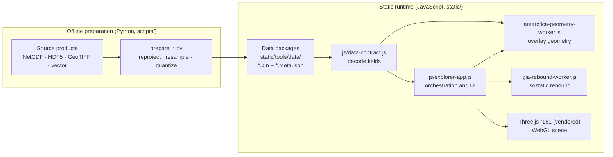

# Architecture

3D ICE has two stages joined by a file-level contract. An offline Python pipeline turns
authoritative cryosphere products into compact, self-describing data packages; a static
JavaScript application fetches those packages and renders them with WebGL. Nothing is
computed on a server, so the published site, a local preview and a downstream deployment
all run the same files.

The data contract is specified in [data-contract.md](data-contract.md). A worked,
reproducible example is in [example.md](example.md).

## Stage 1: preparation pipeline

Each script in `scripts/` reads one source product, reconciles its coordinate conventions
with the polar-stereographic grids used by the viewer, and writes one or more packages.
The expensive work happens here, once, before deployment: streamline integration through
multi-depth ocean velocity fields, re-gridding between terrain products whose origins differ
by 250 m, and hybridising a bed product with another product's surface and mask.

| Script | Source product | Packages written |
| --- | --- | --- |
| `prepare_bedmachine_antarctica.py` | BedMachine Antarctica v4 | `bedmachine_antarctica_v4_{480,741}` |
| `prepare_bedmap3_antarctica.py` | Bedmap3 v1.0 GeoTIFF grids | `bedmap3_antarctica_{10km,4km}` |
| `prepare_bedmachine_greenland.py` | BedMachine Greenland v6 | `bedmachine_greenland_v6_{3km,1km}` |
| `prepare_qrf_greenland.py` | QRF Greenland subglacial topography (2025), with BedMachine Greenland v6 surface and mask | `greenland_qrf_2025_{3km,1km}` |
| `prepare_antarctica_velocity.py` | MEaSUREs phase-based Antarctic ice velocity v1 | `antarctic_ice_velocity_phase_v01_{480,741}` |
| `prepare_greenland_velocity.py` | ITS_LIVE v2 velocity mosaic | `greenland_ice_velocity_{3km,1km}` |
| `prepare_basal_friction.py` | Basal-friction inversions (`taub`) | `antarctica_basal_friction_*`, `greenland_basal_friction_*` |
| `prepare_subglacial_hydrology.py` | GlaDS Antarctic subglacial hydrology | `antarctica_subglacial_hydrology_{480,741}` |
| `prepare_bedmap3_antarctica_overlays.py` | The velocity, basal-friction and hydrology packages above | `bedmap3_antarctica_{velocity,basal_friction,subglacial_hydrology}_{10km,4km}` |
| `prepare_rise_antarctica.py` | RISE multi-model mean basal melt and thermal driving | `rise_antarctica_{480,741}` |
| `prepare_antarctica_ocean_currents.py` | WAOM2 annual-mean ROMS output | `antarctica_ocean_currents_waom2_yr5_annual*` |
| `combine_antarctica_ocean_current_datasets.py` | The cavity-margin and open-ocean streamline packages | `antarctica_ocean_currents_waom2_yr5_annual_combined_cavity80km_remote_open_ocean` |
| `prepare_greenland_ocean_currents.py` | Copernicus Marine Arctic Ocean physics analysis | `greenland_ocean_currents_cmems_202508` |
| `prepare_greenland_basins.py` | Greenland drainage basins | `greenland_basins_ps_v1_4_2.json` |
| `prepare_polar_features.py` | Research-station and place-name catalogues | `*_research_stations.json`, `*_geographic_names.json` |
| `prepare_refined_basin_search.mjs` | IMBIE refined Antarctic basins; the Greenland basins above | `*_refined_basins_search.json` |

The `480`/`10km` and `741`/`4km` suffixes are the Antarctic Balanced (667 × 667 cells at
10 km) and HD (1667 × 1667 at 4 km) grids; Greenland uses 3 km (511 × 918) and 1 km
(1533 × 2752). Every gridded overlay is resampled onto exactly the terrain grid it is
drawn on, so overlay and terrain cells correspond one to one in the browser.

Source products are large and several require registration to download, so they are not
in the repository. The prepared packages are, and each package's metadata names the source
file, product version and reference it was built from.

## Stage 2: static runtime

| Path | Role |
| --- | --- |
| `static/tools/3D-interactive-cryosphere-explorer.html` | English page: metadata, theme and asset-base bootstrap, control markup |
| `static/zh/tools/3D-interactive-cryosphere-explorer.html` | Chinese page: the same shell with translated markup |
| `static/tools/css/explorer.css` | Styles shared by both pages |
| `static/tools/js/explorer-app.js` | Runtime shared by both pages: dataset registry, loading, scene graph, UI wiring, legends, metadata panel |
| `static/tools/js/data-contract.js` | Package decoder (the browser half of the data contract) |
| `static/tools/antarctica-geometry-worker.js` | Module worker that builds velocity, basal-friction, hydrology and ocean-current geometry off the main thread |
| `static/tools/gia-rebound-worker.js` | Module worker for the isostatic-rebound solve |
| `static/tools/js/gia-rebound.js`, `gia-grid.js`, `fft2d.js` | Flexural and Airy isostasy solver, grid utilities and 2-D FFT |
| `static/tools/js/polar-feature-search.js`, `polar-feature-label-style.js`, `polar-refined-basins.js`, `polar-features.js` | Place and feature search, label styling, refined-basin validation, and the controller that binds them to the scene |
| `static/js/3d-ice-locale.js` | English and Chinese strings, published as `window.__3dIceLocale` |
| `static/tools/vendor/three/` | Three.js r161 and `OrbitControls`, vendored so the runtime has no install step |

**Boundaries.** The modules in the table's lower half have no DOM or scene dependencies
and run unchanged under Node's test runner, which is how they are unit-tested.
`explorer-app.js` is the orchestration layer that owns the DOM and the Three.js scene; it is
still large (about 10,000 lines), and moving further domain logic out of it into tested
modules is ongoing work. Both locale pages load the same runtime and stylesheet: they
differ only in markup text and page metadata, and every string the runtime displays is
looked up through `t()`.

**Loading.** Selecting a region and dataset fetches its terrain package and builds the
terrain mesh. Overlay packages are fetched when a layer is first enabled or, after the
first interaction with the scene, prefetched in the background for datasets that allow it.
They are decoded with `data-contract.js` and handed to the geometry worker as transferable
buffers; the worker
posts progress and returns typed arrays that become `BufferGeometry` attributes. Balanced
packages keep mobile memory use low; HD packages target desktop displays.

**Isostatic rebound** is the one layer computed rather than loaded. The rebound worker
solves the equilibrium flexure of an elastic plate over a fluid mantle (or local Airy
isostasy) from the loaded terrain package's bed, surface, thickness and mask, so it needs
no extra data. Browsers without module workers fall back to a main-thread solve.

**Asset base.** Asset URLs resolve against a base taken, in order, from the `assetBase`
query parameter, `window.__ICE_ASSET_BASE__`, a `<meta name="3d-ice-asset-base">` tag,
or the `/tools/` segment of the page's own path. This is what lets the same files serve
from a site root, a GitHub Pages project path, or a downstream site.

**URL parameters.** `region` (`antarctica` or `greenland`) and `preset` (a dataset key,
for example `bedmap3` or `qrf-hd`) choose the initial view; `mode=showcase` and
`mode=preview` are embedding modes; `recording=1` enables the camera-path recording panel.
Layer toggles and camera pose are not written back to the URL; the recording panel copies
the current camera pose as text instead.

**Browser requirements.** WebGL, ES modules with top-level `await`, and module workers:
current Chrome, Edge, Firefox and Safari (Chrome and Edge 89+, Firefox 114+, Safari 15+).

## Deployment

- **GitHub Pages.** `.github/workflows/deploy-pages.yml` publishes `static/` on every push
  to `main`.
- **Compatibility bundle.** `scripts/build_compat_bundle.mjs` packs `static/tools/` into
  `dist/3d-ice-compat.tar.gz` with a SHA-256 checksum and a file manifest, and
  `scripts/smoke_compat_bundle.mjs` checks that every file the runtime needs is present.
  `.github/workflows/release-compat-bundle.yml` attaches the bundle to the GitHub release
  of every `v*` tag.
- **Anywhere else.** Any static file server rooted at `static/` works, for example
  `python3 -m http.server 4173 --directory static`.

## Verification

| What is checked | Tooling | Location | CI job |
| --- | --- | --- | --- |
| Quantization, statistics, coordinate sampling, attribute decoding, preparation scripts | pytest | `tests/test_*.py` | Python unit tests |
| Every committed package decodes in the browser to the statistics Python recorded | node:test | `tests/js/data-contract.test.mjs` | JavaScript unit tests |
| Rebound solver against the analytic point-load (Kelvin function) solution and the Airy limit | node:test | `tests/js/gia-rebound.test.mjs` | JavaScript unit tests |
| Place search, label styling, refined-basin validation | node:test | `tests/js/polar-features.test.mjs` | JavaScript unit tests |
| Every localisation key used at runtime resolves in both locales | node:test | `tests/js/locale-coverage.test.mjs` | JavaScript unit tests |
| Metadata schema of every package; `CITATION.cff` and `codemeta.json` | pytest, cffconvert | `tests/test_metadata_schema.py` | Validate .meta.json files |
| The distributable bundle contains every runtime file | Node | `scripts/smoke_compat_bundle.mjs` | Compatibility bundle smoke test |
| The explorer loads, renders and responds in a real browser | Playwright | `tests/e2e/` | Browser E2E tests |

Commands for running each suite locally are in the [README](../README.md#running-tests).
